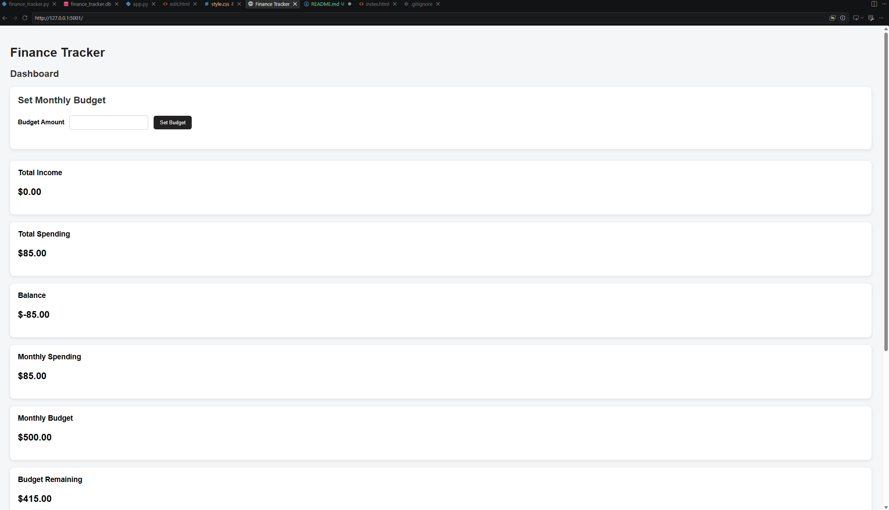
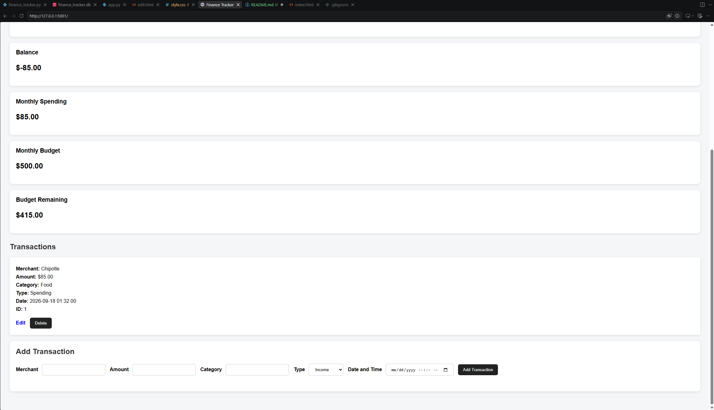
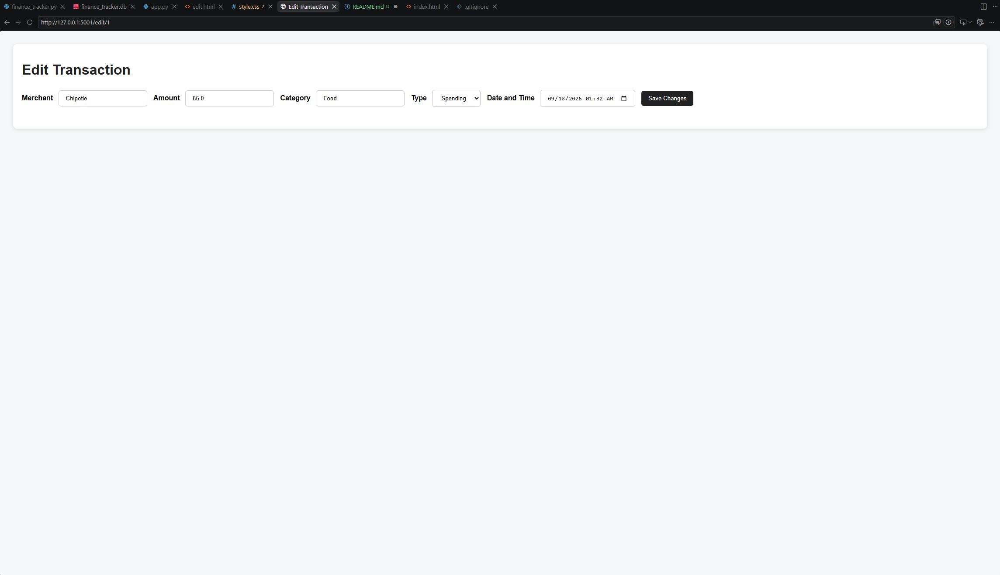

# Personal Finance Tracker

A full-stack personal finance web application built with Python, Flask, SQLite, HTML, and CSS.

The application allows users to track income and spending, organize transactions by category, set a monthly budget, and monitor their financial activity.

## Features

- Add income and spending transactions
- Edit existing transactions
- Delete transactions
- Store transaction data with SQLite
- Track total income and total spending
- Calculate current balance
- Track monthly spending
- Set and update a monthly budget
- Calculate remaining monthly budget
- Form validation for transaction and budget inputs
- Responsive web interface

## Technologies Used

- Python
- Flask
- SQLite
- HTML
- CSS
- Git
- GitHub

## What I Learned

While building this project, I practiced working with Flask routes, HTML forms, SQLite databases, CRUD operations, input validation, and connecting backend logic to a web interface.

I also gained more experience using Git and GitHub to track changes and manage the project throughout development.

## How to Run the Project

1. Clone the repository:

```bash
git clone https://github.com/Kole-Schaefer-Official/finance-tracker.git
```

2. Move into the project folder:

```bash
cd finance-tracker
```

3. Install Flask:

```bash
py -m pip install flask
```

4. Start the application:

```bash
py -m flask --app app run --debug --port 5001
```

5. Open your browser and go to:

```text
http://127.0.0.1:5001
```

## Project Structure

```text
finance-tracker/
├── app.py
├── finance_tracker.py
├── README.md
├── static/
│   └── style.css
└── templates/
    ├── index.html
    └── edit.html

## Screenshots

### Dashboard




### Edit Transaction

